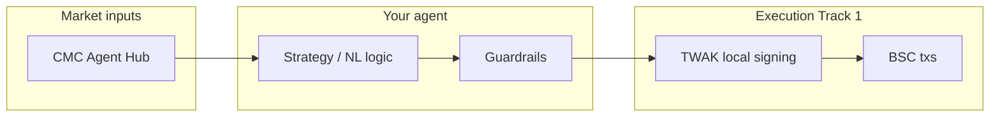

# BNB Hack: AI Trading Agent Edition

**Purpose of this document:** Single source of truth for AI coding agents building in this repo. Read this before implementing features, choosing a track, or wiring integrations.

| Field | Value |
| --- | --- |
| Event | BNB Hack: AI Trading Agent Edition |
| Partners | CoinMarketCap × Trust Wallet × BNB Chain |
| Prize pool | $36,000 cash |
| Build window | June 3 – June 21, 2026 (3 weeks) |
| Registration opens | June 3, 2026, 12:00 UTC |
| Track 1 live trading | June 22 – June 28, 2026 (1 week) |
| Judging | June 29 – July 5, 2026 |
| Winners | Week of July 6, 2026 |
| Community | [BNB Hack Telegram](https://t.me/+MhiOLT0YUnlmNWFk) |

---

## Why build here (agent context)

AI agents in crypto usually fail on **repeated infrastructure**: market data layer, execution/signing layer, then finally agent logic. This hackathon ships a **pre-wired stack** (free for the event) so agents can focus on strategy and behavior.

**Agent takeaway:** Prefer official integrations (CMC Hub, TWAK, BNB AI Agent SDK) over custom RPC/data/signing unless there is a strong reason. Judges and scoring assume this stack for Track 1.

---

## Stack reference (what to integrate)

| Layer | Product | Role for agents |
| --- | --- | --- |
| Data | [CoinMarketCap AI Agent Hub](https://coinmarketcap.com/api/agent) | CEX, derivatives, on-chain, social, KOLs, news. Surfaces: **MCP**, **x402**, **CLI**, **Skills** |
| Execution | [Trust Wallet Agent Kit (TWAK)](https://portal.trustwallet.com) | Self-custody **local signing**, 30+ chains. Surfaces: **MCP**, **REST**, **CLI**, **LangChain**, **x402** |
| BSC agent path | [BNB AI Agent SDK](https://github.com/bnb-chain/bnbagent-sdk) | Fastest path from idea → working agent on BSC |
| Chain | BNB Chain (BSC) | Live trades and on-chain proof for Track 1 |



---

## Track selection (agent decision tree)

1. **Need live autonomous trading on BSC with real PnL scoring?** → **Track 1**
2. **Only a backtestable strategy as a CMC Skill (no execution)?** → **Track 2**
3. **Unsure:** Track 2 is lower bar (CMC only). Track 1 requires CMC + TWAK + live competition registration.

| | Track 1: Autonomous Trading Agents | Track 2: Strategy Skills |
| --- | --- | --- |
| Prize | $24,000 (5 winners) | $6,000 (3 winners) |
| Stack | CMC + TWAK + BNB AI Agent SDK | CMC only |
| Deliverable | Live agent: NL strategy → reads CMC → signs/executes via TWAK on BSC | CMC **Skill** + **backtestable strategy spec** (not live trader) |
| Registration | **On-chain** before June 22 + DoraHacks | **DoraHacks only** by June 21 |
| Primary judging | Live **PnL** (risk gates apply) | Panel: technical execution, originality, relevance, demo |

### Track 1 — what to build

- Natural-language (or structured) **strategy in** → **on-chain execution out**
- Agent **reads markets via CMC**, **decides**, **signs and processes its own txs via TWAK**
- Trades **only eligible BEP-20 tokens** during competition week
- Operates under **rules you set** (limits, allowlists, drawdown, slippage, etc.)

**Example directions (not exhaustive):**

- Funding rates + Fear & Greed → TWAK rotation on BSC perps
- Sentiment-aware DCA agent with personality and self-signed txs
- Copy-trader mirroring top wallets with custom risk filters

### Track 2 — what to build

- A **CMC Skill** that turns market data into a **trading strategy spec**
- Output must be **backtestable** (Quantopian-style, crypto-adapted, LLM-authored Skill)
- **No** live execution layer required

**Example directions:**

- Momentum Skill: RSI + MACD + Fear & Greed entry/exit rules
- Sentiment-divergence Skill: social heat vs on-chain flow mismatch
- Regime-detection Skill: strategy switch from derivatives positioning

---

## Track 1: registration and competition rules

### On-chain registration (required before live window)

- Smart contract on BSC records each participant’s **agent wallet address** (immutable list).
- Entries **after** the trading window opens are **rejected**.
- **Contract (BSC):** `0x212c61b9b72c95d95bf29cf032f5e5635629aed5`  
  Explorer: https://bsctrace.com/address/0x212c61b9b72c95d95bf29cf032f5e5635629aed5

**Register via:**

```bash
twak compete register
```

Or MCP action: `competition_register`

Both resolve the agent wallet and submit the registration transaction.

### DoraHacks (Track 1)

Also register on DoraHacks: submit **agent address** and a **short strategy explanation** (how results were achieved).

### Eligible tokens (149 BEP-20 on CMC)

Trades **outside this list do not count** toward competition scoring.

ETH, USDT, USDC, XRP, TRX, DOGE, ZEC, ADA, LINK, BCH, DAI, TON, USD1, USDe, M, LTC, AVAX, SHIB, XAUt, WLFI, H, DOT, UNI, ASTER, DEXE, USDD, ETC, AAVE, ATOM, U, STABLE, FIL, INJ, 币安人生, NIGHT, FET, TUSD, BONK, PENGU, CAKE, SIREN, LUNC, ZRO, KITE, FDUSD, BEAT, PIEVERSE, BTT, NFT, EDGE, FLOKI, LDO, B, FF, PENDLE, NEX, STG, AXS, TWT, HOME, RAY, COMP, GWEI, XCN, GENIUS, XPL, BAT, SKYAI, APE, IP, SFP, TAG, NXPC, AB, SAHARA, 1INCH, CHEEMS, BANANAS31, RIVER, MYX, RAVE, SNX, FORM, LAB, HTX, USDf, CTM, BDX, SLX, UB, DUCKY, FRAX, BILL, WFI, KOGE, ALE, FRXUSD, USDF, GOMINING, VCNT, GUA, DUSD, SMILEK, 0G, BEAM, MY, SLX, SOON, REAL, Q, AIOZ, ZIG, YFI, TAC, lisUSD, CYS, ZAMA, TRIA, HUMA, PLUME, ZIL, XPR, ZETA, BabyDoge, NILA, ROSE, VELO, UAI, BRETT, OPEN, BSB, TOSHI, BAS, ACH, AXL, LUR, ELF, KAVA, APR, IRYS, EURI, XUSD, BARD, DUSK, SUSHI, PEAQ, COAI, BDCA, XAUM

### Minimum activity (Track 1)

- At least **1 trade per day** during the trading week → **≥ 7 trades** total (June 22–28).

### Track 1 judging (PnL)

- Ranked by **total return** on a **held-out** live window.
- **Max drawdown cap** (e.g. **30%**): exceed threshold → **disqualified** regardless of headline PnL.
- **Minimum trade count** and **simulated transaction costs** apply.
- Goal: **most profit without blowing up**.

**Agent implementation hints:**

- Enforce drawdown, daily/per-trade limits, and token allowlist in code—not only in prompts.
- Log every trade with BSC tx hash for demo and reproducibility.
- Pre-validate swap/trade targets against the eligible token list above.

---

## Track 2: submission

- **No** on-chain registration.
- Submit **Skill + strategy spec** on **DoraHacks** by **end of build window: June 21, 2026**.

### Track 2 judging (panel)

| Criterion | What reviewers look for |
| --- | --- |
| Technical execution | Works; on-chain parts are real, not cosmetic |
| Originality | New angle on a real problem |
| Real-world relevance | Clear user + plausible adoption path |
| Demo and presentation | Clear overview; demo matches repo |

---

## Special prizes ($2,000 each, cross-track)

Can stack with main track placement.

### 1. Best Use of Trust Wallet Agent Kit (Track 1 only)

Target: TWAK as the **heart** of a hands-off trader—not a single swap with logic elsewhere.

| Criterion | Points |
| --- | ---: |
| TWAK integration depth (sole execution layer; signing + autonomous mode + x402, not one swap call) | 30 |
| Self-custody integrity (keys/signing with user; local signing through full trade loop) | 25 |
| Autonomous execution + guardrails (drawdown, allowlists, per-trade/daily limits, slippage) | 20 |
| Native x402 in the trade loop (pay-per-request for data/inference/tools—not README only) | 10 |
| Originality + real-world relevance | 10 |
| Demo (end-to-end self-custody/signing; on-chain proof on BSC) | 5 |

**Self-custody scoring ladder (within 25 pts):**

- Fully self-custodial, clean local signing → 20–25
- Partial custodial step (co-signing, etc.) → 8–15 (by centrality)
- Core loop depends on custody → 0–7 (noted by panel)

**Tie-breaker order:** self-custody integrity → TWAK depth (least replaceable) → substantive x402

### 2. Best Use of Agent Hub (both tracks)

Maximize CMC Hub: MCP, x402, CLI, IDE integrations, pre-built Skills.

### 3. Best Use of BNB AI Agent SDK (both tracks)

Most inventive SDK use; BNB Chain may award full $2k to one team or split.

---

## Prizes

### Track 1 — Autonomous Trading Agents ($24,000)

| Place | Amount |
| --- | ---: |
| 1st | $10,000 |
| 2nd | $6,000 |
| 3rd | $4,000 |
| 4th | $2,000 |
| 5th | $2,000 |

### Track 2 — Strategy Skills ($6,000)

| Place | Amount |
| --- | ---: |
| 1st | $3,000 |
| 2nd | $2,000 |
| 3rd | $1,000 |

### Special prizes

| Award | Amount |
| --- | ---: |
| Best Use of Trust Wallet Agent Kit | $2,000 |
| Best Use of Agent Hub | $2,000 |
| Best Use of BNB AI Agent SDK | $2,000 |

**Non-cash for top projects:** CMC Pro API credits, CMC Labs mentorship, BNB Chain Kickstart Package eligibility.

---

## Submission requirements (all tracks)

Agents should ensure the repo and docs satisfy:

| Requirement | Detail |
| --- | --- |
| On-chain proof | BSC **contract address** or **transaction hash** |
| Reproducibility | **Public repo** + demo link/video **or** clear setup instructions |
| No token launches | No fundraising, liquidity opening, or airdrop pumping before results |
| AI tooling | Encouraged; judged on **whether it works** |
| Violations | May disqualify or invalidate submission |

### Track-specific checklist

**Track 1**

- [ ] `twak compete register` or MCP `competition_register` before **June 22**
- [ ] Agent wallet registered on competition contract
- [ ] DoraHacks: address + strategy write-up
- [ ] Only eligible tokens traded during live week
- [ ] ≥ 7 trades (1/day) June 22–28
- [ ] Risk limits respect drawdown gate (e.g. 30%)
- [ ] Demo shows CMC → decision → TWAK sign → BSC tx

**Track 2**

- [ ] CMC Skill + backtestable strategy spec
- [ ] DoraHacks submission by **June 21**
- [ ] Backtest or spec reproducible from repo

---

## Resources (canonical links)

| Resource | URL |
| --- | --- |
| CoinMarketCap AI Agent Hub | https://coinmarketcap.com/api/agent |
| Trust Wallet Agent Kit | https://portal.trustwallet.com |
| BNB AI Agent SDK | https://github.com/bnb-chain/bnbagent-sdk |
| BNB Hack Telegram | https://t.me/+MhiOLT0YUnlmNWFk |
| Competition contract (BSC) | https://bsctrace.com/address/0x212c61b9b72c95d95bf29cf032f5e5635629aed5 |

---

## Agent build guidelines (repo-level)

When implementing in this workspace:

1. **Confirm track** with the user (Track 1 vs Track 2) before deep execution/signing work.
2. **Track 1:** Treat TWAK as the only execution path; wire CMC for all market reads; use BNB AI Agent SDK where it accelerates BSC deployment.
3. **Hard constraints:** eligible token allowlist, min trade frequency, drawdown disqualifier, no new token launches.
4. **Secrets:** Never commit private keys, seed phrases, or `.env` with credentials; use local signing via TWAK as documented.
5. **Demonstrability:** Prefer structured logs (decision, data used, tx hash, PnL snapshot) for judging and demo video.
6. **x402:** If aiming at TWAK or Agent Hub special prizes, integrate pay-per-request in the **live loop**, not as documentation-only.


