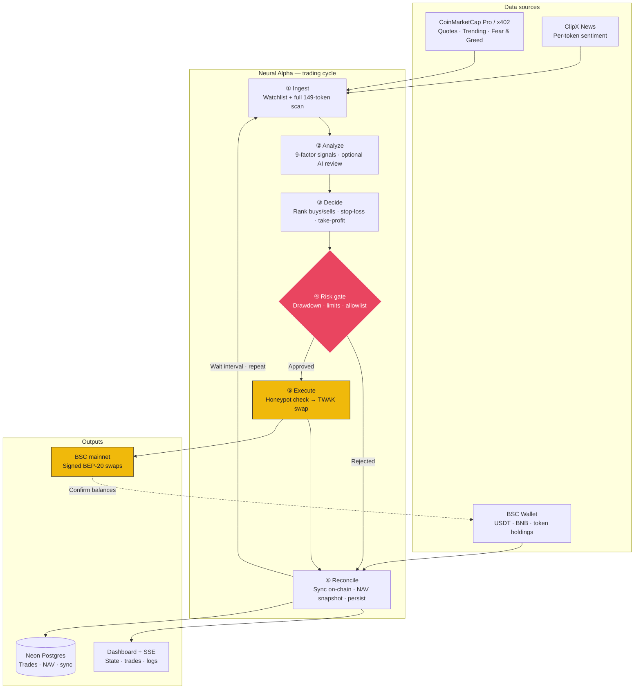

<p align="center">
  <strong>N E U R A L &nbsp; A L P H A</strong>
</p>

<p align="center">
  Autonomous BSC trading agent with real-time dashboard, multi-factor signal engine, and AI-powered analysis.
</p>

<p align="center">
  <a href="https://agents.clipx.app">Live Dashboard</a> &middot;
  <a href="#quick-start">Quick Start</a> &middot;
  <a href="#architecture">Architecture</a> &middot;
  <a href="#deployment">Deployment</a> &middot;
  <a href="#security">Security</a>
</p>

<p align="center">
  
  
  
  
  
</p>

---

## Overview

Neural Alpha is a fully autonomous trading agent for BNB Smart Chain (BSC). It reads market data from CoinMarketCap, processes news sentiment from ClipX, generates multi-factor trading signals, enforces risk guardrails in code, and executes self-custody swaps through the Trust Wallet Agent Kit (TWAK) — all without human intervention.

Built for the **[BNB Hack: AI Trading Agent Edition](https://dorahacks.io/hackathon/bnbhack-twt-cmc/)** (CoinMarketCap x Trust Wallet x BNB Chain), Track 1.

**Production deployment:** [agents.clipx.app](https://agents.clipx.app)

---

## Table of Contents

- [Key Features](#key-features)
- [Architecture](#architecture)
- [Prerequisites](#prerequisites)
- [Quick Start](#quick-start)
- [Configuration](#configuration)
- [Strategy Engine](#strategy-engine)
- [Risk Management](#risk-management)
- [Dashboard](#dashboard)
- [Deployment](#deployment)
- [Security](#security)
- [API Reference](#api-reference)
- [Project Structure](#project-structure)
- [NPM Scripts](#npm-scripts)
- [Troubleshooting](#troubleshooting)
- [Competition](#competition)
- [License](#license)

---

## Key Features

**Signal Engine**
- 9-factor scoring: RSI, MACD, EMA crossover, Bollinger Bands, momentum, volume spikes, mcap:volume turnover, Fear & Greed index, and ClipX news sentiment
- Optional AI technical analysis (GPT-4o-mini or any OpenAI-compatible model) overlaid on top signals each cycle
- Tiered token scanning — active watchlist (15 tokens) every cycle + full scan of all 149 eligible BEP-20 tokens every 3 cycles

**Strategy Presets**
- Three risk-tiered profiles: **SafeTrade** (capital preservation), **Medium** (balanced), **Momentum** (return-seeking)
- Each preset configures signal weights, position sizing, stop-loss/take-profit, trailing stops, and portfolio limits
- Hot-switchable from the dashboard without restart

**Risk Guardrails (enforced in code, not prompts)**
- Max drawdown cap with emergency buy-halt
- Per-trade position limits, daily trade caps, on-chain tx budget
- Stop-loss, take-profit, and trailing stop exits
- Honeypot detection before every live swap
- 149-token allowlist with contract verification

**Execution**
- Self-custody local signing via TWAK — private keys never leave the device
- Paper mode (simulated) and live mode (real BSC swaps)
- On-chain portfolio reconciliation with Binance Web3 Wallet API
- Startup cooldown, failed-swap cooldown, and autonomous trade pacing

**Dashboard**
- Real-time Next.js dashboard with SSE streaming
- Portfolio metrics, equity/drawdown charts, signal monitor, trade history, activity feed
- Wallet panel with on-chain balances, competition registration
- Natural language command assistant (AI-powered when OpenAI key is set)
- Agent controls for live parameter tuning

**Production-Ready**
- API authentication (Bearer token)
- CORS origin restriction, rate limiting, request size limits
- PM2 process management, Nginx reverse proxy, Let's Encrypt SSL
- Neon Postgres persistence for trades, NAV snapshots, and chain sync state
- Graceful shutdown with SIGTERM/SIGINT handling

---

## Architecture

Neural Alpha runs an autonomous loop: **read markets → score signals → validate risk → execute on BSC → reconcile portfolio**. The diagram below is the core agent workflow (one cycle repeats every 30s in paper mode, 60 min in live mode).

### Core Agent Workflow



**In plain terms:**

| Step | What happens |
|------|----------------|
| **Ingest** | Pull prices for the active watchlist; every 3rd cycle, scan all 149 eligible BEP-20 tokens |
| **Analyze** | Blend RSI, MACD, EMA, Bollinger, momentum, volume, news, and Fear & Greed into a score per token |
| **Decide** | Pick the best trades; optional protective exits (stop-loss / take-profit / trailing) run first |
| **Risk gate** | Block trades that breach drawdown, daily caps, position size, token allowlist, or tx budget |
| **Execute** | Live mode: TWAK signs and submits the swap on BSC. Paper mode: simulated fill |
| **Reconcile** | Match portfolio to chain, update NAV, stream to dashboard, save to Postgres, sleep, repeat |

**Operator path:** Browser → [agents.clipx.app](https://agents.clipx.app) → Next.js dashboard → authenticated proxy → agent API (`127.0.0.1:3847`). Manual commands (`buy`, `sell`, `portfolio`) use the same risk and execution path as autonomous trades.

---

## Prerequisites

| Requirement | Purpose |
|---|---|
| **Node.js >= 20** | Runtime (ESM, `import.meta`) |
| **npm >= 9** | Package manager (workspaces) |
| **[TWAK CLI](https://portal.trustwallet.com)** | Wallet + MCP server for self-custody swaps |
| **CMC Pro API key** | Real-time market data |
| **BNB on BSC** | Gas for live transactions |
| **USDT on BSC** | Trading capital (live mode) |

```bash
# Install TWAK CLI
npm install -g @trustwallet/cli
twak --version

# Create a wallet (first time)
twak wallet create
twak wallet address --chain bsc
```

---

## Quick Start

### 1. Clone and install

```bash
git clone https://github.com/your-org/neural-alpha.git
cd neural-alpha
npm install
```

### 2. Configure environment

```bash
cp .env.example .env
```

Minimum configuration:

```bash
# Required
CMC_PRO_API_KEY=<your-key>
TW_ACCESS_ID=<your-twak-access-id>
TW_HMAC_SECRET=<your-twak-hmac-secret>

# Mode
AGENT_MODE=paper          # "paper" for simulation, "live" for real BSC trading
BRIDGE_MODE=auto          # auto-detects TWAK + CMC Pro

# Optional: AI assistant
OPENAI_API_KEY=sk-...     # enables NL commands + AI signal analysis
```

### 3. Run (development)

```bash
npm run dev
```

| Service | URL |
|---|---|
| **Dashboard** | http://localhost:3000 |
| **Agent API** | http://localhost:3847/api/health |

The dashboard header shows **LIVE** when connected to the agent, **DEMO** when offline.

### 4. Run (production)

```bash
npm run prod:build
npm run prod:start      # starts via PM2
```

See [Deployment](#deployment) for full VPS setup.

---

## Configuration

### Paper vs Live Mode

| | Paper (`AGENT_MODE=paper`) | Live (`AGENT_MODE=live`) |
|---|---|---|
| Swaps | Simulated (`paper-*` tx hash) | Real BSC transactions via TWAK |
| Capital | Uses `INITIAL_CASH_USD` | Syncs from on-chain USDT balance |
| Cycle interval | 30s default | 60 min default |
| Portfolio | In-memory only | Reconciled with on-chain state each cycle |

### Environment Variables

All variables are documented in `.env.example`. Key ones:

| Variable | Default | Description |
|---|---|---|
| `AGENT_MODE` | `paper` | `paper` or `live` |
| `BRIDGE_MODE` | `auto` | `auto` / `twak` / `cmc-pro` / `mock` |
| `CMC_PRO_API_KEY` | — | CoinMarketCap Pro API key |
| `TW_ACCESS_ID` | — | TWAK access credentials |
| `TW_HMAC_SECRET` | — | TWAK HMAC secret |
| `AGENT_WALLET_ADDRESS` | — | BSC wallet address (auto-detected from TWAK) |
| `API_SECRET` | — | **Required in production** — Bearer token for API auth |
| `NODE_ENV` | — | Set to `production` on VPS |
| `STRATEGY` | `medium` | `safe` / `medium` / `momentum` |
| `TRADE_INTERVAL_MS` | 30s/60min | Cycle frequency |
| `MAX_DRAWDOWN_PCT` | `20` | Hard drawdown cap (%) |
| `MAX_POSITION_SIZE_USD` | `100` | Per-trade limit (USD) |
| `MAX_DAILY_TRADES` | `10` | Daily autonomous trade cap (set in `.env`; dashboard reads from agent config) |
| `STOP_LOSS_PCT` | `8` | Stop-loss threshold (%) |
| `TAKE_PROFIT_PCT` | `15` | Take-profit threshold (%) |
| `MIN_BUY_CONFIDENCE` | `0.55` | Minimum signal confidence to buy |
| `AUTO_EXIT_ENABLED` | `false` | Enable autonomous stop-loss/take-profit exits |
| `OPENAI_API_KEY` | — | Enables AI assistant + signal analysis |
| `OPENAI_MODEL` | `gpt-4o-mini` | Any OpenAI-compatible chat model |
| `DATABASE_URL` | — | Neon Postgres connection string |
| `CORS_ORIGINS` | — | Additional allowed CORS origins (comma-separated) |
| `DASHBOARD_PORT` | `3847` | Agent API port (internal) |
| `LOG_LEVEL` | `info` | `error` / `warn` / `trade` / `signal` / `info` / `debug` |

---

## Strategy Engine

### Signal Pipeline (9 factors)

| Factor | Weight (Medium) | Source |
|---|---|---|
| RSI (14) | 15 | Price history |
| MACD (12/26/9) | 13 | Price history |
| EMA Crossover (12/26) | 11 | Price history |
| Bollinger Bands (20,2) | 6 | Price history |
| Momentum (10-period) | 18 | Price history |
| Volume Spike | 18 | Volume vs 20-bar avg |
| MCap:Volume Turnover | 7 | CMC |
| Fear & Greed Index | 6 | CMC |
| News Sentiment | 10 | ClipX API |

Weights vary by strategy preset. Signals are ranked by absolute score, then validated by the risk manager before execution.

### Strategy Presets

| Preset | Philosophy | Max DD | Daily Trades | Position Size | Stop/TP |
|---|---|---|---|---|---|
| **SafeTrade** | Capital preservation, confirmed mean-reversion, tight stops | 12% | 3 | 0.6x | 5% / 10% |
| **Medium** | Balanced trend + momentum + volume | 20% | 5 | 0.85x | 8% / 15% |
| **Momentum** | Return-seeking, chases breakouts and volume spikes | 28% | 6 | 1.1x | 10% / 28% |

Switch presets at runtime from the dashboard Agent Controls panel or via the API.

### AI Signal Analysis (Optional)

When `OPENAI_API_KEY` is set and `AI_SIGNAL_ANALYSIS=true`:

- Top N signals per cycle are sent to the LLM with full technical context
- AI returns verdict (bullish/bearish/neutral), confidence, risks, and a one-line summary
- AI insight is overlaid on the signal score and surfaced on the dashboard

---

## Risk Management

All guardrails are enforced in code (`neural-alpha/src/risk/manager.ts`), not prompts:

| Rule | Default | Effect |
|---|---|---|
| Max drawdown | 20% (Medium) | Emergency mode — new buys halted, positions held |
| Stop-loss | 8% | Protective sell triggered |
| Take-profit | 15% | Protective sell triggered |
| Trailing stop | 6% activate / 3% giveback | Locks in gains after activation |
| Daily trade cap | 5/day | Autonomous trades blocked after cap |
| On-chain tx budget | 10/day | Prevents excessive gas spend |
| Max positions | 3 tokens | Portfolio concentration limit |
| Min trade size | $5 | Dust prevention |
| Max position size | $100 | Per-trade cap |
| Confidence gate | 55% | Weak signals filtered |
| Token allowlist | Binance Spot ∪ Alpha | Unknown coins rejected |
| Honeypot check | TWAK `check_token_risk` | Blocked before every live swap |
| Startup cooldown | 120s | Autonomous trades paused after restart |
| Failed swap cooldown | 30 min | Same token not retried immediately |

---

## Dashboard

The Next.js dashboard at `https://agents.clipx.app` provides:

| Panel | Description |
|---|---|
| **Metric Cards** | Portfolio NAV, PnL, drawdown, win rate, daily trades |
| **Equity Chart** | Live portfolio value over time |
| **Drawdown Chart** | Max drawdown visualization |
| **Allocation Chart** | Portfolio composition by token |
| **Signal Monitor** | RSI, MACD, momentum, news sentiment, AI verdict per token |
| **Positions Table** | Open positions with entry price, PnL, weight |
| **Trade History** | Full trade log with BSCScan links for live trades |
| **Activity Feed** | Filterable real-time log stream |
| **Wallet Panel** | Address, BNB/USDT balances, sync, competition registration |
| **Agent Controls** | Max position, interval, drawdown, slippage, strategy preset |
| **Command Panel** | Natural language assistant (AI-powered with OpenAI key) |

The dashboard connects via SSE for real-time streaming — no polling.

---

## Deployment

### Production Architecture

```
Internet → Nginx (SSL) → Next.js :3000 → Agent API :3847 (localhost only) → TWAK → BSC
```

- **Agent API** binds to `127.0.0.1` only — never directly exposed to the internet
- **Dashboard** proxy authenticates with the agent using `API_SECRET`
- **Nginx** terminates SSL, routes traffic, adds security headers

### Quick Deploy (VPS)

```bash
# 1. Clone on VPS
git clone <repo-url> ~/neural-alpha && cd ~/neural-alpha

# 2. Configure
cp .env.example .env && nano .env    # fill in all required values

# 3. Deploy (handles deps, build, nginx, ssl, pm2)
bash deploy/setup.sh
```

The deploy script auto-generates an `API_SECRET` if not set, installs the Nginx config for `agents.clipx.app`, requests an SSL certificate, and starts both services via PM2.

### Manual Deploy

```bash
# Install dependencies
npm ci

# Build everything
npm run prod:build

# Start with PM2
pm2 start ecosystem.config.cjs
pm2 save && pm2 startup
```

### PM2 Operations

```bash
pm2 status                         # check processes
pm2 logs neural-agent --lines 100  # agent logs
pm2 logs neural-dashboard          # dashboard logs
pm2 restart all                    # restart everything
pm2 stop all                       # stop everything
```

### Health Check

```bash
curl https://agents.clipx.app/api/health
# → {"status":"ok","running":true,"uptime":12345,"timestamp":...}
```

### Updating

```bash
cd ~/neural-alpha
git pull
npm ci
npm run prod:build
pm2 restart all
```

Full deployment documentation: [`deploy/DEPLOY.md`](./deploy/DEPLOY.md)

---

## Security

### Authentication

All agent API endpoints (except `/api/health`) require authentication:

```bash
# Set in .env
API_SECRET=<generated-with-openssl-rand-hex-32>
```

The dashboard proxy automatically attaches the token. Direct API calls require:

```
Authorization: Bearer <API_SECRET>
```

### Hardening

| Measure | Implementation |
|---|---|
| API authentication | Bearer token on all mutating/read endpoints |
| CORS restriction | Origin whitelist (`agents.clipx.app` + `localhost`) |
| Rate limiting | 120 req/min per IP (in-memory token bucket) |
| Body size limits | 64KB max request body |
| SSE connection cap | 20 concurrent clients |
| Localhost binding | Agent API on `127.0.0.1` only |
| Security headers | `X-Frame-Options`, `X-Content-Type-Options`, `HSTS`, `Referrer-Policy` |
| Error sanitization | No stack traces in production responses |
| Input validation | Whitelist of allowed config keys, command length limits |
| TWAK self-custody | Private keys never leave the device |
| Graceful shutdown | SIGTERM/SIGINT handlers with timeout |

### Best Practices

- **Never commit** `.env`, private keys, seed phrases, or `~/.twak/`
- Use a **dedicated hot wallet** with limited funds
- Token allowlist enforced in code — ineligible tokens rejected
- Honeypot screening before every live swap
- Drawdown cap enforced in code, not prompts

---

## API Reference

All endpoints are prefixed with `/api/`. Authentication required unless noted.

### Read Endpoints

| Method | Path | Description |
|---|---|---|
| `GET` | `/api/health` | Health check (no auth) |
| `GET` | `/api/state` | Full agent state snapshot |
| `GET` | `/api/logs` | Last 100 log entries |
| `GET` | `/api/events` | SSE stream (state + log events) |
| `GET` | `/api/wallet` | Wallet address, BNB/USDT balances |
| `GET` | `/api/competition/status` | Competition registration status |

### Control Endpoints

| Method | Path | Description |
|---|---|---|
| `POST` | `/api/control/start` | Start trading loop |
| `POST` | `/api/control/stop` | Pause trading loop |
| `POST` | `/api/control/restart` | Reset portfolio and restart |
| `POST` | `/api/control/resync` | Force on-chain portfolio reconciliation |
| `POST` | `/api/control/config` | Update agent configuration |
| `POST` | `/api/control/watchlist` | Set token watchlist |
| `POST` | `/api/command` | Execute NL command |
| `POST` | `/api/wallet/sync` | Sync USDT balance from chain |
| `POST` | `/api/wallet/mode` | Switch wallet mode (local/walletconnect) |
| `POST` | `/api/competition/register` | Submit on-chain competition registration |

---

## Project Structure

```
neural-alpha/
├── ecosystem.config.cjs          # PM2 process configuration
├── package.json                   # Monorepo root (npm workspaces)
├── .env.example                   # Environment template
├── deploy/
│   ├── DEPLOY.md                  # Deployment documentation
│   ├── nginx.conf                 # Nginx reverse proxy config
│   └── setup.sh                   # One-command deploy script
│
├── neural-alpha/                  # Autonomous trading agent
│   ├── package.json
│   └── src/
│       ├── index.ts               # Entry point + graceful shutdown
│       ├── agent.ts               # Core trading loop + state management
│       ├── config.ts              # 149-token allowlist, configuration
│       ├── commands/
│       │   ├── handler.ts         # NL command router + trade execution
│       │   └── llm.ts             # OpenAI-compatible assistant
│       ├── data/
│       │   ├── market.ts          # CMC quotes, price history, F&G
│       │   └── news.ts            # ClipX news fetcher
│       ├── db/
│       │   ├── schema.sql         # Neon Postgres schema
│       │   └── store.ts           # Persistence layer (trades, NAV, sync)
│       ├── execution/
│       │   └── executor.ts        # TWAK swap builder + result processor
│       ├── integrations/
│       │   ├── create-bridge.ts   # Bridge factory (TWAK / CMC Pro / mock)
│       │   ├── twak-mcp-bridge.ts # TWAK MCP client
│       │   ├── cmc-pro-bridge.ts  # CMC Pro REST bridge
│       │   ├── bsc-token-addresses.ts  # BEP-20 contract resolution
│       │   ├── binance-web3-wallet.ts  # Binance Web3 position sync
│       │   └── bscscan.ts         # CLI wallet scanner
│       ├── risk/
│       │   ├── manager.ts         # Risk validation + emergency mode
│       │   └── portfolio.ts       # PnL tracking, snapshots, reconciliation
│       ├── strategy/
│       │   ├── index.ts           # Strategy orchestrator
│       │   ├── signals.ts         # 9-factor signal scoring
│       │   ├── presets.ts         # SafeTrade / Medium / Momentum profiles
│       │   ├── ai-analyst.ts      # GPT-powered technical analysis
│       │   ├── news-sentiment.ts  # ClipX NLP sentiment analyzer
│       │   └── indicators.ts      # RSI, MACD, EMA, BB, ATR
│       ├── utils/
│       │   ├── logger.ts          # Structured logging + SSE fan-out
│       │   └── types.ts           # Shared TypeScript interfaces
│       └── web/
│           └── server.ts          # Agent HTTP API + SSE + auth + rate limiting
│
└── dashboard/                     # Next.js 15 live monitoring UI
    ├── package.json
    ├── next.config.ts             # Security headers, production config
    └── src/
        ├── app/
        │   ├── page.tsx           # Main dashboard page
        │   ├── layout.tsx         # Root layout
        │   └── api/agent/[...path]/
        │       └── route.ts       # Authenticated proxy to agent API
        ├── components/dashboard/  # 13 UI panels
        ├── hooks/
        │   └── useAgentConnection.ts  # SSE client + state management
        └── lib/
            ├── agent-api.ts       # Typed API client
            ├── agent-url.ts       # Agent URL resolution
            ├── map-agent-state.ts # API → dashboard state mapping
            └── mock-data.ts       # Offline demo data
```

---

## NPM Scripts

| Command | Description |
|---|---|
| `npm run dev` | Dashboard only |
| `npm run dev:all` | Market feed + agent + dashboard |
| `npm run market-feed` | Shared market snapshot (CMC once → all agents) |
| `npm run agent` | Agent only |
| `npm run agent:dev` | Agent with hot reload |
| `npm run dashboard` | Dashboard dev server |
| `npm run build` | Build all workspaces |
| `npm run prod:build` | Production build (agent + dashboard) |
| `npm run prod:start` | Start via PM2 (feed + agent + dashboard) |
| `npm run prod:stop` | Stop via PM2 |
| `npm run prod:restart` | Restart via PM2 |
| `npm run prod:logs` | PM2 log viewer |
| `npm run prod:status` | PM2 process status |
| `npm run prod:deploy` | Full deployment script |

---

## Troubleshooting

### Dashboard shows DEMO / offline

The agent isn't running. Start both services:

```bash
npm run dev
```

### Trades show no BSC tx hash in live mode

1. Confirm `AGENT_MODE=live` in `.env`
2. Ensure wallet has both USDT (trading capital) and BNB (gas)
3. Restart the agent after funding
4. Check logs: `pm2 logs neural-agent` or `tail -f neural-alpha/logs/agent.jsonl`

### API returns 401 Unauthorized

`API_SECRET` mismatch between agent and dashboard. Ensure both read the same `.env` file, or set `API_SECRET` in the dashboard's environment.

### Port 3847 already in use

The agent automatically retries ports 3847-3852. If all are taken, stop other agent processes:

```bash
pm2 stop neural-agent
# or
lsof -i :3847
```

### TWAK wallet issues

```bash
twak wallet status          # check wallet state
twak wallet balance --chain bsc  # verify funds
```

The `could not register testnet node for smartchain-testnet` warning is harmless on mainnet.

---

## Competition

### BNB Hack: AI Trading Agent Edition

| Field | Value |
|---|---|
| Track | Track 1 — Autonomous Trading Agents |
| Prize Pool | $24,000 (5 winners) + $2,000 special prizes |
| Live Trading | June 22 - 28, 2026 |
| Contract (BSC) | [`0x212c61b9b72c95d95bf29cf032f5e5635629aed5`](https://bsctrace.com/address/0x212c61b9b72c95d95bf29cf032f5e5635629aed5) |

### Competition Rules Enforcement

| Rule | Implementation |
|---|---|
| >= 1 trade/day, >= 7 total | Daily trade floor in live mode (auto-triggers at UTC 20:00) |
| 149 eligible BEP-20 only | Hard-coded allowlist in `config.ts` |
| Max drawdown ~30% (DQ) | 25% cap in `risk/manager.ts` |
| Self-custody execution | All swaps via TWAK MCP (local signing) |
| On-chain proof | Every live trade logged with BSC tx hash |

### Registration

```bash
# On-chain registration (required before live window)
npm run register
twak compete register
twak compete status    # registered: true
```

### TWAK MCP Tools Used

| Tool | Purpose |
|---|---|
| `get_token_price` | BSC spot prices |
| `get_swap_quote` | Pre-trade quote |
| `swap` | Execute BEP-20 swap |
| `wallet_balance` | BNB balance |
| `get_balance` | USDT balance |
| `check_token_risk` | Honeypot screening |
| `get_trending_tokens` | Watchlist discovery |
| `x402_request` | CMC Agent Hub micropayments |
| `competition_register` | On-chain registration |
| `competition_status` | Registration check |

---

## Resources

| Resource | URL |
|---|---|
| Live Dashboard | https://agents.clipx.app |
| CMC Agent Hub | https://coinmarketcap.com/api/agent |
| Trust Wallet Agent Kit | https://portal.trustwallet.com |
| BNB AI Agent SDK | https://github.com/bnb-chain/bnbagent-sdk |
| Deployment Guide | [deploy/DEPLOY.md](./deploy/DEPLOY.md) |

---


