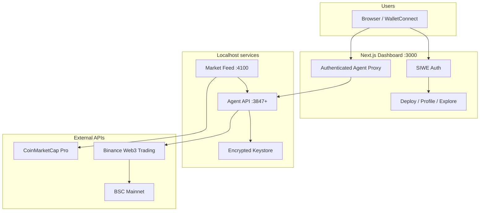

<p align="center">
  <strong>N E U R A L &nbsp; A L P H A</strong>
</p>

<p align="center">
  Public multi-tenant platform for autonomous BSC trading agents — deploy, fund, and monitor self-custodial agents from a single dashboard.
</p>

<p align="center">
  <a href="https://agents.clipx.app">Live Platform</a> &middot;
  <a href="#quick-start">Quick Start</a> &middot;
  <a href="#architecture">Architecture</a> &middot;
  <a href="#deployment">Deployment</a> &middot;
  <a href="#security">Security</a>
</p>

<p align="center">
  
  
  
  
  
  
</p>

---

## Overview

Neural Alpha is a **public agents infrastructure** for BNB Smart Chain. Users connect a wallet, sign in with SIWE, deploy their own trading agent, fund an encrypted on-server keystore wallet, and control strategy settings from the dashboard — no TWAK, no external signing service.

Each agent runs an autonomous loop: read shared market data → score signals → enforce risk guardrails → execute swaps via **viem + Binance Web3 DEX aggregator** → reconcile portfolio on-chain.

**Production:** [agents.clipx.app](https://agents.clipx.app)

---

## Table of Contents

- [Key Features](#key-features)
- [User Flow](#user-flow)
- [Architecture](#architecture)
- [Prerequisites](#prerequisites)
- [Quick Start](#quick-start)
- [Configuration](#configuration)
- [Agent Categories](#agent-categories)
- [Strategy & Risk](#strategy--risk)
- [Dashboard](#dashboard)
- [Deployment](#deployment)
- [Security](#security)
- [Project Structure](#project-structure)
- [NPM Scripts](#npm-scripts)
- [Troubleshooting](#troubleshooting)
- [License](#license)

---

## Key Features

**Platform**
- SIWE wallet login (Browser wallet + WalletConnect)
- One-click agent deploy with on-chain fee verification
- Per-agent encrypted BIP-39 keystore (seed shown once at deploy)
- Owner-scoped API routes — only the deploying wallet can control an agent
- Public **Explore** page and optional read-only monitor mode

**Trading Engine**
- Multi-factor signal scoring (RSI, MACD, EMA, Bollinger, momentum, volume, Fear & Greed, news sentiment)
- Optional AI technical analysis overlay (OpenAI-compatible)
- Strategy presets: **SafeTrade**, **Medium**, **Momentum**
- Risk guardrails enforced in code — drawdown cap, position limits, daily trade caps, stop-loss / take-profit / trailing stops

**Data & Execution**
- Shared **market feed** sidecar — one CMC/Binance poll serves all agents
- Safe token universe: Binance Spot ∪ Binance Alpha (~300+ BSC tokens, 6h cache)
- Agent categories at deploy time: Spot · Alpha · Default (both) · **bStocks** (on-chain equities)
- Self-custodial EVM wallet per agent; swaps via Binance Web3 aggregator (no direct Pancake V2 pools)

**Operations**
- PM2 process management (market feed + dashboard + per-agent processes)
- Neon Postgres for platform registry, deploy fees, and agent metadata
- Nginx reverse proxy with Let's Encrypt SSL

---

## User Flow

1. **`/login`** — Connect wallet → SIWE sign-in
2. **`/deploy`** — Choose agent category and settings → pay deploy fee (if treasury configured) → agent provisioned
3. **Save seed phrase** — Shown once; never stored in the database
4. **Fund wallet** — Send **USDT** (trading capital) and **BNB** (gas) to the agent address
5. **`/agents/{id}`** — Start trading, tune settings, view live dashboard, backup seed
6. **`/profile`** — List your agents; **`/explore`** — Browse public agents

---

## Architecture



**Trading cycle (per agent):**

| Step | What happens |
|------|----------------|
| **Ingest** | Read quotes, OHLCV, news, Fear & Greed from shared market feed |
| **Analyze** | Score tokens in the agent's universe (Spot / Alpha / bStocks) |
| **Decide** | Rank buys/sells; run protective exits first |
| **Risk gate** | Block trades breaching drawdown, caps, allowlist, or tx budget |
| **Execute** | Sign and submit swap via viem + Binance Web3 aggregator |
| **Reconcile** | Sync on-chain balances, update NAV, stream to dashboard |

---

## Prerequisites

| Requirement | Purpose |
|---|---|
| **Node.js ≥ 20** | Runtime (ESM) |
| **npm ≥ 9** | Monorepo workspaces |
| **CMC Pro API key** | Market data |
| **Binance Web3 API key + secret** | DEX aggregator quotes and swaps |
| **Neon Postgres** | Multi-tenant platform (deploy, sessions, registry) |
| **WalletConnect project ID** | Mobile wallet login |

For live trading, each agent wallet needs **USDT** (capital) and **BNB** (gas) on BSC mainnet.

---

## Quick Start

### 1. Clone and install

```bash
git clone https://github.com/ClipXonchain/agents.git
cd agents
npm install
```

### 2. Configure environment

```bash
cp .env.example .env
```

Minimum for local multi-tenant dev:

```bash
# Market data & execution
CMC_PRO_API_KEY=<your-key>
BINANCE_WEB3_API_KEY=<your-key>
BINANCE_WEB3_API_SECRET=<your-secret>
BRIDGE_MODE=evm

# Platform
DATABASE_URL=postgresql://...@.../neondb?sslmode=require
SESSION_SECRET=<openssl rand -hex 32>
WALLET_MASTER_SECRET=<openssl rand -hex 32>
SIWE_DOMAIN=localhost:3000,127.0.0.1:3000
NEXT_PUBLIC_WALLETCONNECT_PROJECT_ID=<walletconnect-id>

# Shared market feed
MARKET_FEED_URL=http://127.0.0.1:4100
DISABLE_SINGLETON_AGENT=true
```

See [`.env.example`](./.env.example) for the full reference.

### 3. Run (development)

```bash
npm run dev:all
```

| Service | URL |
|---|---|
| **Dashboard** | http://localhost:3000 |
| **Market feed** | http://127.0.0.1:4100/health |
| **Agent API** | Spawned per deploy (default base port 3847) |

Visit `/login` → `/deploy` to create your first agent.

### 4. Run (production)

```bash
npm run prod:build
bash deploy/setup.sh
```

Full VPS guide: [`deploy/DEPLOY.md`](./deploy/DEPLOY.md)

---

## Configuration

### Deploy modes

| Mode | Use case | Key env |
|------|----------|---------|
| **Operator platform** | Users deploy and control their own agents | `READONLY=false`, `DATABASE_URL`, secrets |
| **Public monitor** | Read-only showcase | `READONLY=true`, `NEXT_PUBLIC_READONLY=true` |

### Important environment variables

| Variable | Description |
|---|---|
| `BRIDGE_MODE` | Must be `evm` — self-custodial BSC wallet |
| `WALLET_MASTER_SECRET` | Derives per-agent keystore passwords (≥32 chars, unique) |
| `SESSION_SECRET` | Encrypts SIWE session cookies (≠ `API_SECRET`) |
| `SIWE_DOMAIN` | Public hostname(s), no `https://` |
| `MARKET_FEED_URL` | Shared snapshot URL (default `http://127.0.0.1:4100`) |
| `AGENT_UNIVERSE` | `spot` · `alpha` · `both` · `bstocks` (set at deploy) |
| `DISABLE_SINGLETON_AGENT` | `true` for multi-tenant (dashboard spawns agents) |
| `PLATFORM_TREASURY_ADDRESS` | BSC address for deploy fee |
| `DEPLOY_FEE_BNB` | Default `0.01` |

### Removed — do not set

| Variable | Notes |
|---|---|
| `TW_ACCESS_ID` / `TW_HMAC_SECRET` | TWAK integration removed |
| `AGENT_MODE=paper` | Paper mode removed — live only |
| `AGENT_PRIVATE_KEY` | Forbidden in production — use keystore |
| `DISABLE_DRAWDOWN_LIMIT` | Forbidden in production |

---

## Agent Categories

Set at deploy time via `AGENT_UNIVERSE`:

| Category | Token universe | Strategy notes |
|---|---|---|
| **Spot** | Binance Spot BEP-20 list | Standard multi-factor signals |
| **Alpha** | Binance Alpha BSC list (~300+, 6h sync) | Trending rank boost |
| **Default** | Spot ∪ Alpha | Broadest coverage |
| **bStocks** | Dedicated on-chain equities (TSLAB, NVDAB, …) | Equity Trend strategy; Ondo `*ON` excluded elsewhere |

Mega-cap filter excludes top coins (BTC, ETH, SOL, BNB, …) by default. Optional `MAX_TRADABLE_MARKET_CAP_USD` ceiling ($10B default).

Reference snapshot of Alpha tickers: [`alpha.md`](./alpha.md) — live list is synced from Binance API.

---

## Strategy & Risk

### Strategy presets

| Preset | Philosophy | Max DD | Daily trades |
|---|---|---|---|
| **SafeTrade** | Capital preservation | 12% | 3 |
| **Medium** | Balanced trend + momentum | 20% | 5 |
| **Momentum** | Return-seeking breakouts | 28% | 6 |

Presets are hot-switchable from the agent settings panel.

### Risk guardrails (code-enforced)

| Rule | Default | Effect |
|---|---|---|
| Max drawdown | 25% hard cap | Emergency mode — new buys halted |
| Stop-loss / take-profit | Preset-dependent | Protective sells |
| Daily trade cap | 10 | Autonomous trades blocked after cap |
| Token allowlist | Spot ∪ Alpha | Unknown tokens rejected |
| Startup cooldown | 120s | No autonomous trades right after restart |
| Failed swap cooldown | 30 min | Same token not retried immediately |

All rules live in `neural-alpha/src/risk/manager.ts`.

---

## Dashboard

| Page / Panel | Description |
|---|---|
| **`/`** | Landing and featured agents |
| **`/login`** | Wallet connect + SIWE |
| **`/deploy`** | Create a new agent |
| **`/agents/{id}`** | Live control panel — metrics, signals, positions, trades, settings |
| **`/profile`** | Your deployed agents |
| **`/explore`** | Browse public agents |
| **Metric cards** | NAV, PnL, drawdown, win rate |
| **Signal monitor** | Per-token scores, indicators, AI verdict |
| **Agent settings** | Strategy preset, intervals, risk limits, gas presets |
| **Command panel** | Natural language assistant (when `OPENAI_API_KEY` set) |

Real-time updates via SSE through the authenticated `/api/agent/*` proxy.

---

## Deployment

```
Internet → Nginx (SSL) → Next.js :3000 → Agent API :3847+ (localhost) → BSC
                              ↑
                    Market Feed :4100 (localhost)
```

- Agent API and market feed bind to **`127.0.0.1` only**
- Dashboard handles SIWE auth, deploy, and proxied agent control
- Per-agent PM2 processes spawned by the dashboard (`neural-agent-<uuid>`)

```bash
# One-command VPS setup
bash deploy/setup.sh

# Update from laptop (rsync + rebuild)
VPS_HOST=root@YOUR_VPS_IP bash deploy/sync-to-vps.sh
```

See [`deploy/DEPLOY.md`](./deploy/DEPLOY.md) for secrets checklist, nginx, SSL, and troubleshooting.

---

## Security

| Control | Implementation |
|---|---|
| SIWE sessions | Required for deploy, backup, config, mutations |
| Per-agent API secret | Auto-derived on deploy; proxy injects Bearer token |
| Keystore encryption | AES-256-GCM; password from `WALLET_MASTER_SECRET` + agent ID |
| Owner isolation | Agent routes require matching wallet session |
| `READONLY` mode | Blocks proxy mutations on public monitor |
| Localhost binding | Agent API + market feed not internet-facing |
| Deploy fee | On-chain tx verified in production (anti-replay) |
| Safe token list | Binance Spot ∪ Alpha only |

**Never commit** `.env`, `.env.local`, private keys, seed phrases, or `data/agents/`.

Use a dedicated hot wallet with limited funds for each agent.

---

## Project Structure

```
agents/
├── ecosystem.config.cjs       # PM2: market-feed, dashboard, optional singleton agent
├── .env.example               # Full environment reference
├── deploy/                    # VPS setup, nginx, sync scripts
├── bnbagent-sidecar/          # Optional ERC-8004 identity registration hook
│
├── neural-alpha/              # Autonomous trading agent runtime
│   └── src/
│       ├── agent.ts           # Core trading loop
│       ├── config.ts          # Token allowlist, agent config
│       ├── market-feed/       # Shared CMC/Binance snapshot sidecar
│       ├── wallet/            # Encrypted keystore + viem wallet manager
│       ├── integrations/
│       │   ├── evm-wallet-bridge.ts
│       │   ├── binance-web3-trading.ts
│       │   └── binance-alpha-tokens.ts
│       ├── strategy/          # Signals, presets, AI analyst
│       ├── risk/              # Drawdown, limits, portfolio
│       ├── execution/         # Swap builder + result processor
│       └── web/server.ts      # Agent HTTP API + SSE
│
└── dashboard/                 # Next.js platform UI
    └── src/
        ├── app/
        │   ├── login/ deploy/ profile/ explore/
        │   ├── agents/[id]/   # Per-agent control panel
        │   └── api/
        │       ├── auth/      # SIWE nonce + verify
        │       └── agents/    # Deploy, config, backup, start
        └── lib/
            ├── platform-db.ts
            ├── agent-process-manager.ts
            └── session.ts
```

---

## NPM Scripts

| Command | Description |
|---|---|
| `npm run dev:all` | Market feed + agent + dashboard (local dev) |
| `npm run dev` | Dashboard only |
| `npm run market-feed` | Shared market snapshot sidecar |
| `npm run agent:dev` | Single agent with hot reload |
| `npm run prod:build` | Production build |
| `npm run prod:start` | Start via PM2 |
| `npm run prod:deploy` | Full VPS setup script |

---

## Troubleshooting

| Symptom | Fix |
|---|---|
| Dashboard shows offline | Start `npm run dev:all`; check PM2 logs |
| `SESSION_SECRET required` | Set in `.env`, rebuild dashboard |
| Agent won't trade | Fund USDT + BNB; verify `BRIDGE_MODE=evm` and Binance Web3 keys |
| Swap quote fails | Check `BINANCE_WEB3_API_KEY` / `BINANCE_WEB3_API_SECRET` |
| 401 on agent commands | Log in via SIWE; ensure owner wallet matches agent |
| CMC errors | Verify `CMC_PRO_API_KEY` plan and credits |
| Phantom PnL | Run `npm run db:clear-paper --workspace=neural-alpha`; unset `INITIAL_CASH_USD` |

More: [`deploy/DEPLOY.md`](./deploy/DEPLOY.md#troubleshooting)

---

## Resources

| Resource | URL |
|---|---|
| Live platform | https://agents.clipx.app |
| Repository | https://github.com/ClipXonchain/agents |
| CMC Pro API | https://coinmarketcap.com/api/ |
| Binance Web3 Trading API | https://web3.binance.com/en/dev-docs |
| Deployment guide | [deploy/DEPLOY.md](./deploy/DEPLOY.md) |
| AI agent instructions | [AGENTS.md](./AGENTS.md) |

---

## License

See repository license file.
